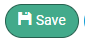
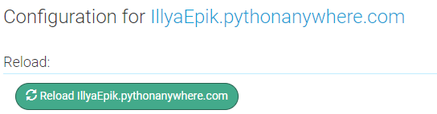

# Online store

* [Ілля Епік / Illya Epik](https://github.com/IllyaEpik/online-store)
* [Марк Попович / Mark Popovch](https://github.com/markpopovich9/online-store)
* [Кирило Харлан / Kyrylo Kharlan](https://github.com/KirillKharlan/online-store)

## Назва проекту: Онлайн-магазин / name project: Online store
#### description:
  - This app is used to sell and buy products
#### опис:
  - Цей додаток використовується для продажу та купівлі продуктів
###### інтерактивна демоверсія проекту:
<video controls src="2024-06-28 20-47-37.mp4" title="demoVersion"></video>
###### Чому проект корисений. Що саме корисного несе ваш проект для оточуючих, особливо для вас як для новачків у цьому напрямку:
  - Він корисний тим що удобний для використання і він корисний тим що він готовий для заробітку грошей
###### Why the project is used. What exactly is your project useful for others, especially for you as a beginner in this direction:
 - It is useful because it is convenient to use and it is useful because it is ready for earning money
------
#### Список модулей необхідних для завантаження:
1. flask; обов'язковий для роботи веб сайту / required for website operation
2. flask_login; потрібен для того, щоб користувач міг зайти під акаунтом / needed so that the user can log in to the account
3. telebot; потрібен для роботи телеграм бота / needed for telegram bot to work
4. sqlite3; необхідний роботи бази даних з телеграм ботом / needed for database operation with telegram bot
5. flask_mail; потрібен для надсилання повідомлень на гугл пошту / needed to send messages to Google mail
6. flask_sqlalchemy; потрібен для роботи веб-сайту з базою даних / needed to send messages to Google mail
7. flask_migrate; потрібен для роботи веб-сайту з базою даних / needed to send messages to Google mail

# instructions for local launch / інструкція для локального запуску:
1. встановіть всі потрібні модулі у ваш пайтон / install all the necessary modules in your Python
2. заходимо гіт одного з розробників: [посилання на гіт тут](https://github.com/IllyaEpik/online-store) / go to the git of one of the developers: [link to git here](https://github.com/IllyaEpik/online-store)
3. натискаємо на зелену кнопку "код" після натискаємо на кнопку "завантажити zip" / click on the green “code” button and then click on the “download zip” button
4.  
5. після цих дій розархівуємо zip файл у потрібну вам папку та запускаємо manage.py / After these steps, unzip the zip file into the folder you need and run manage.py 
## інструкція із запуску на pythonAnyWhere:
1. Запам'ятайте для переміщення між папками в консолі використовується cd назва папки
2. Відкрийте консоль в pythonAnyWhere
3. Придумайте назву віртуальної середи
4. Надрукуйте ```mkvitualenv (назва віртуальної середи)``` в консолі
5. Надрукуйте ```source .virtualenvs/(назва віртуальної середи)/bin/activate``` в консолі
6. Завантажте всі потрібні модулі через pip install
7. Перейдіть в потрібну папку в якій ви хочете завантажити додаток в консолі
8. Надрукуйте ```git clone https://github.com/IllyaEpik/online-store``` в консолі
9. Надрукуйте ```cd mysite/(назва віртуальної середи)/project``` в консолі
10. Надрукуйте ```flask --app settings db init``` в консолі
11. Надрукуйте ```flask --app settings db migrate``` в консолі
12. Надрукуйте ```flask --app settings db upgrade``` в консолі
13. Перейдіть в розділ **Web**
14. Пролистайте до **Source code** та додайте ```/mysite/online-store``` до того що там вже є
15. Зробіть з **Working directory** та надрукуйте те саме що в **Source code** 
16. WSGI configuration file: натискайте на ссилку
17.  після цього напишите в 16 строчці: ```from project import shop as application```
18.  натиснiть на зелену кнопочку: 
19.  тепер поверніться назад 
20.  перегортайте на вверх до 
21.  
22. нажміть на зелену кнопочку reload
23. натисніть на синій текст
    
## instructions for running on pythonAnyWhere:
1. Remember to move between folders in the console using cd folder name
2. Open the console in pythonAnyWhere
3. Come up with a name for the virtual environment
4. Type ```mkvitualenv (virtual environment name)'' in the console
5. Type ```source .virtualenvs/(virtual environment name)/bin/activate''' in the console
6. Download all required modules via pip install
7. Go to the desired folder in which you want to download the application in the console
8. Type ```git clone https://github.com/IllyaEpik/online-store''' in the console
9. Type ```cd mysite/(virtual environment name)/project''' in the console
10. Type ``flask --app settings db init'' in the console
11. Type ``flask --app settings db migrate'' in the console
12. Type ``flask --app settings db upgrade'' in the console
13. Go to the **Web** section
14. Browse to **Source code** and add ```/mysite/online-store''' to what is already there
15. Make from **Working directory** and print the same as in **Source code**
16. WSGI configuration file: click on the link
17. after that, write in line 16: ```from project import shop as application''
18. click on the green button: 
19. now go back
20. scroll up to
21. 
22. click on the green reload button
23. click on the blue text

# структура проекту / project structure:
* домашня сторінка - є головною сторінкою сайту
* сторінка реєстрації - потрібна для того щоб коритувач міг зареєструватись
* сторінка авторизації - потрібна для того щоб коритувач міг авторизуватись
* сторінка магазину - потрібна для того щоб коритувач міг додати до тележки  товар який він хоче,а також використовується адміністрацією для зміну товару 
* сторінка тележки - потрібна щоб користувач міг купити товар який є в тележці
* сторінка контактів - ???


#### project/settings.py: приклад створення головного додатку / an example of creating a main application:
  
```python
# імпортуємо модуль flask
import flask 
# імпортуємо модулыі flask_sqlalchemy та flask_migrate
import flask_sqlalchemy, flask_migrate
# імпортуємо модуль os 
import os
# створюємо головний додаток
shop = flask.Flask(
    import_name= "settings",
    instance_path=   os.path.abspath(__file__ + "/.."),
    template_folder= "project/templates"
)
```
+ registration_page/app.py 
+ опис / description: приклад створення додатку сторінки (Blueprint) / example of creating a page application (Blueprint)
```python
# імпортуємо модуль flask
import flask
# створюємо blueprint для regitration_page
reg =  flask.Blueprint(
    name="reg",
    import_name="app",
    template_folder="registration_page/templates",
    static_folder= "registration_page/static",
    static_url_path=  '/reg/'
)

```
## посіб налаштування Blueprint у файлі urls
+ project/urls.py
+ опис / description: активує сторінки сайту / activates the site pages
```python
import basket_page.app
import basket_page.views
from registration_page import reg,render_reg_page
from home_page import home,render_home_page
from login_page import login,render_login_page
import shop_page, shop_page.app, shop_page.views
from .settings import shop
import basket_page
import contacts_page, contacts_page.app, contacts_page.views
home.add_url_rule(rule="/",view_func= render_home_page, methods = ['GET', 'POST'])
login.add_url_rule(rule= "/login/",view_func=render_login_page, methods=["GET","POST"])
reg.add_url_rule(rule="/reg/",view_func=render_reg_page, methods=["GET","POST"] )
basket_page.app.basket.add_url_rule(rule="/basket/",view_func=basket_page.views.render_basket_page,methods = ["GET","POST"] )
shop_page.app.shop.add_url_rule(rule="/shop/",view_func= shop_page.views.render_shop_page, methods = ['GET', 'POST'])
contacts_page.app.contacts.add_url_rule(rule="/contacts/",view_func=contacts_page.views.render_contacts_page,methods = ["GET","POST"] )

shop.register_blueprint(blueprint=shop_page.app.shop)
shop.register_blueprint(blueprint= basket_page.app.basket)
shop.register_blueprint(blueprint= contacts_page.app.contacts)
shop.register_blueprint(blueprint= home)
shop.register_blueprint(blueprint= reg)
shop.register_blueprint(blueprint= login)
```
## повний опис фалів settings, mail_config, login_manager
+ project/settings.py
+ опис / description: цей файл потрібен для того щоб створити головний додаток та налаштувати підключення до бази даних / this file is needed to create the main application and configure the connection to the database
```python
# імпортуємо модуль flask
import flask 
# імпортуємо модулыі flask_sqlalchemy та flask_migrate
import flask_sqlalchemy, flask_migrate
# імпортуємо модуль os 
import os
# створюємо головний додаток
shop = flask.Flask(
    import_name= "settings",
    instance_path=   os.path.abspath(__file__ + "/.."),
    template_folder= "project/templates"
)
# підключаємо базу даних
shop.config['SQLALCHEMY_DATABASE_URI'] = "sqlite:///data.db"
DATABASE  = flask_sqlalchemy.SQLAlchemy(app=shop)
MIGRATE = flask_migrate.Migrate(app=shop , db= DATABASE)
```
+ project/mail_config.py
+ опис / description: ця частина використовується для конфігурації  почти / this part is used for mail configuration
```python
# імпортуємо flask_mail
import flask_mail
# імпортуємо з settings shop та базу даних
from .settings import shop,DATABASE
# вказуемо пошту адміністратора
ADMINISTRATION_ADRESS = "artemvaschenko83@gmail.com"
# вказуємо пароль від пошти адміністратора
ADMINISTRATION_PASSWORD = "sncj nczy toqt atlm"

# налаштовуємо mail головного додатку
shop.config["MAIL_SERVER"] = 'smtp.gmail.com'
shop.config["MAIL_PORT"] = 587
shop.config["MAIL_USE_TLS"] = True
shop.config["MAIL_USERNAME"] = ADMINISTRATION_ADRESS
shop.config["MAIL_PASSWORD"] = ADMINISTRATION_PASSWORD
# создаємо єкземпляр классу Mail
mail = flask_mail.Mail(app=shop)
```

+ project/login_manager.py
+ опис / description: цей файл потрібен для того щоб користувач міг авторизуватись / this file is required for the user to be authorized
```python
# імпортуємо flask_login
import flask_login
# імпортуємо shop з settings та User з models який знаходиться в registration_page
from .settings import shop
from registration_page.models import User
# указуємо ключ голоного додатку
shop.secret_key = "KEY"
# створюємо екзимпляр классу LoginManager
login_manager = flask_login.LoginManager(app = shop)
# робимо завантаження юзера
@login_manager.user_loader
def load_user(id):
    return User.query.get(id)
```
+ login_page/templates/login.html
+ опис / description: форма використовується для використання модального вікна / form is used to use a modal window
```html



    authorization page



    <a href="/login/">authorization</a>
    
    <form method="post">
        <p class="login">Login or Email</p>
        <input type="text" id="login" name="login" required>
        <p class="password">Password</p>
        <input type="password" id="password" name="password" required>
        
        <button id="send">Send</button>
    </form>
    
        <div>
            <h1>YOU ARE NOT REGISTERED </h1>
            <a href = '/reg/' id="reg">{{ code }}</a>
        </div>
        <div id="background"></div>
    




    <link rel="stylesheet" href="{{ url_for('login.static', filename = '/css/style.css') }}">

```
+ registration_page/templates/reg.html
+ опис / description: форма використовується для використання модального вікна / form is used to use a modal window
```html



    Reg page



    <a href="/reg/">Registration</a>
    
    <form method="post">
        <p class="login">Login</p>
        <input type="text" id="login" name="login" required>
        <p class="email">Email</p>
        <input type="email" id = "email" name="email" required>
        <p class="password">Password</p>
        <input type="password" id="password" name="password" required>
        <p class="Password_confirmation">Password confirmation</p>
        <input type="password" id="password_confirmation" name="Password_confirmation" required>

        <button id="send">Send</button>
    </form>
    
        <div>
            <h1>CONFIRMED</h1>
            <a href = '/login/' id="log">{{ code }}</a>
        </div>
        <div id="background"></div>
    
    



    <link rel="stylesheet" href="{{ url_for('reg.static', filename = '/css/style.css') }}">

```
+ home_page/templates/home.html
```html



    Home page



    
        <div id="log">

            <a class="first">HOME</a>
            <a id="shop" href="/shop/">SHOP</a>
            <a id="basket" href="/basket/">CART</a>
            <a id="contacts" href="/contacts/">CONTACTS</a>
            <p id="end">{{ code }}</p>
            
                <div class="message"><p id="message">{{count}}</p></div>
            
        </div>
    
        <div>
            <a href="/reg/" id="first">Registration </a>
            <a href="/login/" class="end">Autorization</a>
        </div>
    
    <h1>HOME PAGE</h1>



    <link rel="stylesheet" href="{{ url_for('home.static', filename = '/css/style.css') }}">

```
+ contacts_page/templates/contacts.html
```html


shop page


    <link rel="stylesheet" href="{{ url_for('contacts.static', filename = '/css/style.css') }}">




<div id="log">

    <a class="first" href="/">HOME</a>
    <a id="shop" href="/shop/">SHOP</a>
    <a id="basket" href="/basket/">CART</a>
    <a id="contacts" href="/contacts/">CONTACTS</a>
    <p id="end">{{ name }}</p>
</div>

<div class="message"><p id="message">{{count}}</p></div>


```
+ project/templates/base.html
+ опис / description: він викоритовується як головний шаблон для інших шаблонів
```html
<html lang="en">
    <head>
        <meta charset="UTF-8">
        <meta name="viewport" content="width=device-width, initial-scale=1.0">
        <title> </title>
         
    </head>
    <body>
        

        
    </body>
</html>
```
+ shop_page/templates/shop.html
+ опис / description: перший form використовується для видалення продуктів, а другий form використувується для змінення продуктів, а третій form для додавання продуктів / the first form is used to remove products, and the second form is used to change products, and the third form is used to add products
```html


shop page


    <link rel="stylesheet" href="{{ url_for('shop.static', filename = '/css/style.css') }}">
    <script type="module" src="{{ url_for('shop.static', filename = '/js/main.js') }}" defer></script>




<div id="log">

    <a class="first" href="/">HOME</a>
    <a id="shop" href="/shop/">SHOP</a>
    <a id="basket" href="/basket/">CART</a>
    <a id="contacts" href="/contacts/">CONTACTS</a>
    <p id="end">{{ name }}</p>
</div>
<div class="message"><p id="message">{{count}}</p></div>

<div class="start1">
    
</div>

<div class = "add">
    <p class = "addText">Додати продукт<button class = 'editorButton plus'></button></p>
</div>

<div class="start1">
    
</div>


    <div class="start">
        
        
                <button class = "editorButton img" name="img" type="submit" value="{{product.id}}">
                    
                </button>
           
        
        <div class = "product">
            <div class = "inner">
                
            
            
                <h1>{{ product.name }}
                        <button class = "editorButton name" name="name" type="submit" value="{{product.id}}">
                            
                        </button>
                </h1>  
                
                <h3 class="price">{{ product.price}} грн
                        <button class = "editorButton priceButton" name="price" type="submit" value="{{product.id}}" >
                            
                        </button>
                </h3>

                <h3 class="discount">Знижка {{product.discount}}%
                        <button class = "editorButton discountButton" name="discount" type="submit" value="{{ product.id}}">
                            
                        </button>
                </h3>
            
                <h1>{{ product.name }}</h1>  
                <h3 class="price">{{ product.price}} грн</h3>
                <h3 class="discount">Знижка {{product.discount}}%</h3>
            
            
                <style scoped>
                    #scop {
                        margin-bottom: 20px;
                        height: 50px;
                    }
                </style>
                <h1 id="scop">{{ product.name }}</h1>  
            
            <h2>{{ int(product.price - product.discount/100*product.price)  }} грн</h2>
            <button class="buy" id = "{{ product.id }}" >Купити</button>
            <h3 class="capacity">Ємність:</h3>
            
                <div id = "{{ product.id}}">
                    <button class = "orange capacityButton" id = "{{ product.id}}">256 Гб
                        <button class = "editorButton b1">
                            
                        </button>
                    </button>
                    
                    <button class = "white capacityButton" id = "{{ product.id}}">512 Гб
                        <button class = "editorButton b2">
                            
                        </button>
                    </button>
                    <button class="white capacityButton" id = "{{ product.id}}">1 Тб
                        <button class = "editorButton b3" >
                            
                        </button>
                    </button>
                </div>
            
                <div id = "{{ product.id }}">
                    <button class="orange capacityButton" id = "{{ product.id}}">256 Гб</button>
                    <button class="white capacityButton" id = "{{ product.id}}">512 Гб</button>
                    <button class="white capacityButton" id = "{{ product.id}}">1 Тб</button>
                </div>
            
            
                <form class="deleteForm" method="post">
                    
                    <button class="delete deleteP" type="submit" name="delete" value="{{product.id}}">Видалити Товар</button>
                </form>
            
                <div class="deleteForm">
                    <button type="button" class="end" > ✓ </button>
                    <h4  class="count">Товар в наявності</h4>
                </div>
            
            </div>
        </div>
        
    </div>
   
    


<form class="modal-window" method="post" enctype="multipart/form-data" style="display: none;">
    <h1 class="name-edit change">CHANGE IMAGE:</h1>
    <input type = "file" name = "data" accept= "" class="modal-input" id="">
    <label for="img" class="label-img">
        <span class="select">SELECT A FILE</span>
        <span class="filename">NO FILE SELECTED</span>
    </label>
    <button class="send-button" name = "send" value = "{{id}};{{type}}">SEND</button>
</form>
```
+ basket_page/templates/basket.html
+ опис / description: перший form використовується для відмінення замовлення, другий form для оформлення замовлення / the first form is used to cancel an order, the second form to place an order
```html


Cart page


    <link rel="stylesheet" href="{{ url_for('basket.static', filename = '/css/style.css') }}">
    <script src="{{ url_for('basket.static', filename = '/js/script.js') }}" defer type="module"></script>




<div id="log">

    <a class="first" href="/">HOME</a>
    <a id="shop" href="/shop/">SHOP</a>
    <a id="basket" href="/basket/">CART</a>
    <a id="contacts" href="/contacts/">CONTACTS</a>
    <p id="end">{{ name }}</p>
</div>

<h1 class="oformed">Ваші дані у обробці 
    консультант зв’яжеться з вами для підтвердження замовлення</h1>

<div class="message"><p id="message">{{count}}</p></div>
<h1 id="empty">cart empty</h1>


    <div class="start" id="{{product.id}}">
        
        <div class="border">
            <p class="product-name">{{ product.name }}</p>  
            
            <div class="edit">
                <button id="{{product.id}}" class="edit1">-</button>
                <h2 id="count">0</h2>
                <button id="{{product.id}}" class="edit2">+</button>
            </div>
            
            <div class="edit">
                
                <h2 id="count">0</h2>
                
            </div>
            
            <div class="price-div">
                <h2 id="{{ product.price }}" class="price-h2">{{ product.price }}</h2>
                <h3 id="{{ product.discount }}" class="price-h3">грн</h3>
            </div>
        </div>
    </div>


<div class="forms">
    
    <button class="form">Перейти до оформлення</button>
    <h3 class = "count-products">0-и товари на сумму</h3>
    <h3 class = "price">133 997 грн</h3>
    <h3>Знижка</h3>
    <h3 class = "discount">0 грн</h3>
    <h2>Загальна сумма</h2>
    <h3 class = "all-price">133 997 грн</h3>
</div>


    <form class="after-form" method="post">
        <div style="text-align: center;">
            <h2 class="price-name">Загальна вартість замовлення: <span class = "all-price" style="position: unset;"></span></h2>
        </div>
        
        <button class="form" name="type" value="after-form">Відмінити замовлення</button>
    </form>

<div class="modal" style="display: none;">
    <form action="" method="post" class="forming">
        <h1  name="type" value="form">оформлення замовлення</h1>
        <h2 class="data">Ім'я</h2>
        <input type="text" name="name" required class="get-data">
        <h2 class="data">Прізвище</h2>
        <input type="text" name="surname" required class="get-data">
        <h2 class="data">Телефон замовника</h2>
        <input type="text" name="phone" required class="get-data">
        <h2 class="data">Email замовника</h2>
        <input type="text" name="email" required class="get-data">
        <h2 class="data">Місто отримувача</h2>
        <input type="text" name="city" required class="get-data">
        <h2 class="data">Відділеня нової пошти</h2>
        <input type="text" name="post" required class="get-data">
        <h2 class="data">Додаткові побажання</h2>
        <Textarea type="text" name="add" class="get-data"></Textarea>
        <button type="submit" class="submit" name="submit" value="">Send</button>
    </form>
    <div class="background"></div>
</div>

```

<form class="modal-window-add" method="post" enctype="multipart/form-data" style="display: none;">
    <h1 class="new-product">NEW PRODUCT</h1>
    <h1 class="name-edit add">IMAGE PRODUCT:</h1>
    <input type = "file" name = "image" accept= "image/*" class="modal-input add" id="img" style="display:none;">
    <label for="img" class="label-img">
        <span class="select">SELECT A FILE</span>
        <span class="filename">NOT FILE SELECTED</span>
    </label>
    <h1 class="name-edit add">NAME PRODUCT:</h1>
    <input type = "text" name = "name" class="modal-input add">
    <h1 class="name-edit add">DESCRIPTION PRODUCT:</h1>
    <textarea name="description"class="modal-input add" ></textarea>
    
    <h1 class="name-edit add">PRICE PRODUCT:</h1>
    <input type = "text" name = "price" class="modal-input add">

    <h1 class="name-edit add">DISCOUNT PRODUCT:</h1>
    <input type = "text" name = "discount" class="modal-input add">
    
    <h1 class="name-edit add">COUNT PRODUCT:</h1>
    <input type = "text" name = "count" class="modal-input add">
    <button class="send-button" name="add_product" value="NEW" >Send</button>
</form>

<div class="background" style="display: none;"></div>

```


+ login_page/views.py 
+ опис / description: none 
```python
# імпортуємо flask
import flask 
#імпортуємо flask_login
import flask_login
# імпортуємо class User з models
from registration_page.models import User
# імпортуємо render_home_page з views
from home_page.views import render_home_page
# створюємо функцію render_login_page
def render_login_page():
    
    code=False
    if flask_login.current_user.is_authenticated:
        return flask.redirect('/')
    else:
        
        if flask.request.method == "POST":
            code="--> registration"
            for user in User.query.filter_by(login=flask.request.form['login']):
                if user.password == flask.request.form['password']:
                    flask_login.login_user(user)
                    code=False
                    # возвращаемо код html сторінки home_page
                    return flask.redirect('/')
            if  code:
                for user in User.query.filter_by(email=flask.request.form['login']):
                    if user.password == flask.request.form['password']:
                        flask_login.login_user(user)
                        code = False
                        # возвращаемо код html сторінки home_page
                        return flask.redirect('/')
            
    # возвращаемо код html сторінки 
    return flask.render_template(
        template_name_or_list= "login.html",
        code=code
    )
```

+ shop_page/views.py
+ опис / description: none
```python
# імпортуємо flask
import flask
# імпортуємо flask_login
import flask_login
# імпортуємо os
import os
# імпортуємо DATABASE з project
from project.settings import DATABASE
# імпортуємо class Product з models
from registration_page.models import Product
dict_types={
    "IMG":"IMG",
    "NAME":"TEXT",
    "PRICE":"INT",
    "DISCOUNT": "INT"
}
# створюємо функцію render_shop_page
def render_shop_page():
    mod = False
    type1 = None
    id = None
    if flask.request.method == "POST":
        try:
            flask.request.form["send"].split(";")[1]
            print('heloo2323')
            type1 = flask.request.form["send"].split(";")[1]

            if type1 == "IMG":
                id = int(flask.request.form["send"].split(";")[0])
                path= os.path.abspath(__file__ + "/../static/image/"+ Product.query.all()[id-1].name+ ".png") 

                img = flask.request.files.get('data')
                if img.filename != "":
                    try:
                        os.remove(path)
                    except:
                        pass
                    img.save(path)
                os.rename
            elif dict_types[type1] == "TEXT" or dict_types[type1] == "INT":
                next = True
                text = flask.request.form['data']
                if dict_types[type1] == "INT":
                    try:
                        int(text)
                    except:
                        next = False
                if text != "" and next:
                    id = flask.request.form["send"].split(";")[0]
                    if type1 == "NAME":
                        path1 = os.path.abspath(__file__ + "/../static/image/"+Product.query.get(id).name+ ".png")
                        path2 = os.path.abspath(__file__ + "/../static/image/"+text+ ".png")
                        Product.query.get(id).name = text
                        os.rename(path1,path2)
                    if type1 == "PRICE":
                        Product.query.get(id).price = text
                    if type1 == "DISCOUNT":
                        Product.query.get(id).discount = text
                        DATABASE.session.commit()
                        DATABASE.session.commit()
        except Exception as Error:
            print(Error)
            try:
                print('hello')
                id =flask.request.form['delete']
                product = Product.query.get(id)
                DATABASE.session.delete(product)
                DATABASE.session.commit()
                os.remove(os.path.abspath(__file__ + "/../static/image/"+product.name+ ".png"))
            except:
                try:
                    flask.request.form['add_product']
                    product =  Product(
                        name= flask.request.form["name"],
                        description =flask.request.form["description"],
                        count = flask.request.form["count"],
                        price = flask.request.form["price"],
                        discount = flask.request.form["discount"],
                        capacity1 = "256 Гб",
                        capacity2 = "512 Гб",
                        capacity3 = "1 Тб"
                    )
                    next = True
                    for product_data in Product.query.all():
                        if product.name == product_data.name:
                            next = False
                    if next:
                        flask.request.files["image"].save(os.path.abspath(__file__ + "/../static/image/"+product.name+ ".png"))
                        DATABASE.session.add(product)
                        DATABASE.session.commit()
                except:
                    
                    
                    pass
            mod = True
    try:
        count =  len(flask.request.cookies.get('products').split(" "))
        if flask.request.cookies.get('products').split(" ")[0]== "":
            count = "0"
    except:
        count = "0"
    DATABASE.session.commit()
    admin=flask_login.current_user.is_admin
    # возвращаемо код html сторінки
    cookie = flask.make_response(
        flask.render_template(template_name_or_list="shop.html",
                              name=flask_login.current_user.login, 
                              products = Product.query.all(),
                              count = count,
                              int = int,
                              admin =admin,
                              type = type1,
                              mod = mod,
                              id = id
                              ))
    
    return cookie
```

+ basket_page/views.py 
+ опис / description: none
```python
# імпортуємо flask
import flask
# імпортуємо flask_login
import flask_login
# імпортуємо class Product Cart User з models
from registration_page.models import Cart, Product, User
# імпортуємо Message з flask_mail
from flask_mail import Message
# імпортуємо mail, ADMINISTRATION_ADRESS,DATABASE з mail_config
from project.mail_config import mail, ADMINISTRATION_ADRESS,DATABASE
# ствоюємо функцію render_basket_page
def render_basket_page():
    send=False
    print(2132113)
    if flask.request.method == "POST":
        print(flask.request.form)
        if flask.request.form.get('name'):
            try:
                import telegram_bot
            
                text=f"До вас звернувся користувач сайту:\n"
                text+= f"ім'я: {flask.request.form['name']}\n"
                text+= f"призвище: {flask.request.form['surname']}\n"
                text+= f"номер телефону: {flask.request.form['phone']}\n"
                text+= f"електрона пошта: {flask.request.form['email']}\n"
                text+= f"місто отримувача: {flask.request.form['city']}\n"
                text+= f"Відділення нової почти: {flask.request.form['post']}\n"
                text+= f"додаткові побажання: {flask.request.form['add']}\n"
                
                cart = Cart(
                    id = len(Cart.query.all()),
                    user_id = flask_login.current_user.id,
                    list_products = flask.request.cookies.get('products'),
                    chat_id = telegram_bot.global_id,
                    message_id = telegram_bot.bot.send_message(
                        telegram_bot.global_id,
                        text=text,
                        message_thread_id=telegram_bot.list_id["cart"],
                        reply_markup=telegram_bot.telebot.types.InlineKeyboardMarkup([[telegram_bot.telebot.types.InlineKeyboardButton(text='get user',callback_data=f'cart_{len(Cart.query.all())}')]])
                        ).message_id
                )
                DATABASE.session.add(cart)
                DATABASE.session.commit()
                send = True
            except Exception as error :
                print(error)
            try:
                text=f"До вас звернувся користувач сайту:\n"
                text+= f"ім'я: {flask.request.form['name']}\n"
                text+= f"призвище: {flask.request.form['surname']}\n"
                text+= f"номер телефону: {flask.request.form['phone']}\n"
                text+= f"електрона пошта: {flask.request.form['email']}\n"
                text+= f"місто отримувача: {flask.request.form['city']}\n"
                text+= f"Відділення нової почти: {flask.request.form['post']}\n"
                text+= f"додаткові побажання: {flask.request.form['add']}\n"
                message = Message(
                    "Message Order",
                    sender= ADMINISTRATION_ADRESS, 
                    recipients= ['epi99k@gmail.com'], 
                    body= text
                )
                mail.send(message)
                send = True
            except Exception as error:
                print(error)
        else:
            try:
                import telegram_bot
                carts = Cart.query.all()
                for cart1 in carts:
                    if cart1.user_id == flask_login.current_user.id:
                        message = Message(
                            "Message Order",
                            sender= ADMINISTRATION_ADRESS, 
                            recipients= ['epi99k@gmail.com'], 
                            body= f'користувач {flask_login.current_user.login} скасував замовлення'
                        )
                        mail.send(message)
                        send = False
                        telegram_bot.bot.delete_message(chat_id=cart1.chat_id,message_id=cart1.message_id)
                        DATABASE.session.delete(cart1)
                        DATABASE.session.commit()
            except Exception as error:
                print(error)
    try:
        count =  flask.request.cookies.get('products').split(" ") 
    except:
        count = "0"
    print(Cart.query.all())
    for cart1 in Cart.query.all():
        if cart1.user_id == flask_login.current_user.id:
            send = True
    list_count = {}
    for product1 in Product.query.all():
        list_count[str(product1.id)] = str(count.count(str(product1.id)))
        print(type(product1.id))
    # возвращаемо код html сторінки
    cookie = flask.make_response(
        flask.render_template(template_name_or_list="basket.html",
                              name=flask_login.current_user.login, 
                              products = Product.query.all(),
                              cookie = list_count,
                              count = len(count),
                              send = send
                              ))
    return cookie
```

+ home_page/views.py 
+ опис / description: none
```python
# імпортуємо flask
import flask 
# імпортуємо flask_login
import flask_login
# ствоюємо функцію render_home_page
def render_home_page():
    try:
        count =  len(flask.request.cookies.get('products').split(" ")) # python + flask get
        if flask.request.cookies.get('products').split(" ")[0]== "":
            count = "0"
    except:
        count = "0"
    code=False
    if flask_login.current_user.is_authenticated:
        code=flask_login.current_user.login
    print(code)
    # возвращаемо код html сторінки
    return flask.render_template(
        template_name_or_list= "home.html", 
        code=code,
        count=count
    )
```

+ registration_page/views.py
+ опис / description: none
```python
# імпортуємо flask
import flask
# імпортуємо з models клас User
from .models import User
# імпортуємо з settings базу даних
from project.settings import DATABASE
# створюємо функцію render_reg_page
def render_reg_page():
    code  = False
        
    if flask.request.method == "POST":
        print(flask.request.form)
    
        if flask.request.form['password'] == flask.request.form['Password_confirmation']:
            

            user = User(
                login = flask.request.form['login'],
                email = flask.request.form['email'],
                password = flask.request.form['password'],
                is_admin = False
            )

            try:
                DATABASE.session.add(user)
                DATABASE.session.commit()
                code = "--> authorization"
            except Exception as error:
                return error
    # вертаємо код сторінки
    return flask.render_template(
        template_name_or_list= "reg.html",
        code =  code
    )
```
+ contacts_page/views.py
```python
# імпортуємо flask
import flask
# імпортуємо flask_login
import flask_login
# створюємо функцію render_contacts_page
def render_contacts_page():
    try:
        count =  len(flask.request.cookies.get('products').split(" ")) # python + flask get
        if flask.request.cookies.get('products').split(" ")[0]== "":
            count = "0"
    except:
        count = "0"
    # возвращаемо код html сторінки
    return flask.render_template(template_name_or_list="contacts.html",name=flask_login.current_user.login,count=count)
```
+ registration_page/models.py
+ опис / description: потрібен для створення таблиць та роботи з ними / is needed to create tables and work with them
```python
# імпортуємо з settings базу даних
from project.settings import DATABASE
# імпортуємо flask_login
import flask_login
# створюємо класс User 
class User(DATABASE.Model, flask_login.UserMixin):
    id = DATABASE.Column(DATABASE.Integer, primary_key = True)
    login= DATABASE.Column(DATABASE.String(55))
    email= DATABASE.Column(DATABASE.String(255))
    password =  DATABASE.Column(DATABASE.String(255))
    is_admin = DATABASE.Column(DATABASE.Boolean, nullable = False)
    def __repr__(self) -> str:
        return f"login - {self.login}"
# створюємо класс Product  
class Product(DATABASE.Model, flask_login.UserMixin):
    id = DATABASE.Column(DATABASE.Integer, primary_key = True)
    name = DATABASE.Column(DATABASE.String(60))
    description = DATABASE.Column(DATABASE.Text)
    count = DATABASE.Column(DATABASE.Integer)
    price = DATABASE.Column(DATABASE.Integer)
    discount = DATABASE.Column(DATABASE.Integer)
    capacity1 = DATABASE.Column(DATABASE.String(10), nullable = False)
    capacity2 = DATABASE.Column(DATABASE.String(10), nullable = False)
    capacity3 = DATABASE.Column(DATABASE.String(10), nullable = False)
    def __repr__(self) -> str:
        return f"id - {self.id}"
# створюємо класс Cart
class Cart(DATABASE.Model):
    id = DATABASE.Column(DATABASE.Integer, primary_key = True)
    user_id = DATABASE.Column(DATABASE.Integer, primary_key = True)
    list_products = DATABASE.Column(DATABASE.Text)
    message_id = DATABASE.Column(DATABASE.Integer)
    chat_id = DATABASE.Column(DATABASE.Integer)
    def __repr__(self) -> str:
        return f"id - {self.id}"
```
- shop_page/static/js/main.js
```js
import check from "./modules/capacity.js"
import add from "./modules/add.js"
import cordinate from "./modules/coordinate.js"
import modal from "./modules/modal.js"
import add_modal from "./modules/add_modal.js"
import image from "./modules/image.js"

check()
cordinate()
add()
modal()
add_modal()
image()
```
- shop_page/static/js/modal.js
- description / опис: функція modal потрібна щоб відкрити модальне вікно для зміни даних / the modal function is needed to open a modal window for changing data
```js
function modal(){
    let names = document.getElementsByClassName("name")
    let priceList = document.querySelectorAll(".priceButton")
    let discountList = document.querySelectorAll(".discountButton")
    let imgList = document.getElementsByClassName("img")
    let modal = document.querySelector(".modal-window")
    let background = document.querySelector(".background")
    let nameEdit = document.querySelector(".name-edit")
    let modalInput = document.querySelector(".modal-input")
    let sendButton = document.querySelector(".send-button")
    let labelImg = document.querySelector(".label-img")
    function text(dataList,value){
        for (let count = 0; count < dataList.length; count++){
            let data = dataList[count]
            data.addEventListener("click", ()=>{
                background.style.display = "block"
                modal.style.display = "flex"
                nameEdit.textContent = "change text"
                modalInput.type = "text"
                modalInput.style.borderRadius = "10px"
                modalInput.style.height = "74px"
                modalInput.style.width = "450px"
                sendButton.value = data.value + value
                labelImg.style.display = "none"
            })
        }
        
    }
    text(priceList, ";PRICE")
    text(names, ";NAME")
    text(discountList, ";DISCOUNT")
    for (let count = 0; count < imgList.length; count++){
        let img = imgList[count]
        img.addEventListener("click", ()=>{
            background.style.display = "block"
            modal.style.display = "flex"
            modalInput.id = "img"
            modalInput.style.display= "none"
            modalInput.accept = 'image/*'
            sendButton.value = img.value + ";IMG"
        })
    }
}
export default modal
```
- shop_page/static/js/capacity.js
- description / опис: функція check потрібна щоб можна було переключати кнопки ємності / the check function is needed to be able to switch the capacity buttons
```js
function check(){
    let white = document.querySelectorAll(".white")
    let orange = document.querySelectorAll(".orange")
    console.log(white , orange)
    for (let count = 0; count < white.length; count++){
        white[count].style.background = "white"
    }
    for (let count = 0; count < orange.length; count++){
        orange[count].style.background = "#EFCB4A"
    }
    let capacityButtons = document.querySelectorAll(".capacityButton")

    for (let count = 0; count < capacityButtons.length; count++){
        capacityButtons[count].addEventListener("click", function (event){
            
            for (let count1 = 0; count1 < capacityButtons.length; count1++){
                if (capacityButtons[count].id==capacityButtons[count1].id){
                    capacityButtons[count1].style.background = "white"
                }
            }
            capacityButtons[count].style.background = "#EFCB4A"
        })}
}
export default check 
```
- shop_page/static/js/coordinate.js
- description / опис: функція coordinate потрібна щоб розставити елементи по потрібним місцям / the coordinate function is needed to place elements in the right places
```js
function cordinate(){
    document.querySelector("#message").style.top = `-19`
    let deleteP = document.getElementsByClassName("deleteP")
    let deleteImg = document.getElementsByClassName("deleteImg")
    let y = 420
    for (let count = 0; count < deleteImg.length; count++){
        deleteImg[count].style.top = y
        deleteP[count].style.top = y
        y += 320
    }
    if (document.cookie=="" || document.querySelector("#message").textContent=="0"){
        console.log(document.querySelector("#message").innerHTML)
        document.querySelector(".message").style.display = 'none'
        document.querySelector("#message").style.display = 'none'
    }
    
}
export default cordinate
```
- shop_page/static/js/image.js
- description / опис: функція image потрібна щоб після зміни картинки змінювався текст в input / the image function is needed so that after changing the picture, the text in the input changes
```js
function image(){
    let inputs = document.querySelectorAll("input")
    let filenames = document.querySelectorAll(".filename")
    for(let count = 0; count < inputs.length; count++){
        inputs[count].addEventListener("change", function (){
            if(inputs[count].type == "file"){
                console.log(inputs[count].files[0].name)
                for(let count1 = 0; count1 < filenames.length; count1++){
                    filenames[count1].textContent = inputs[count].files[0].name
                }
            }  
        })
    }
}
export default image
```
- shop_page/static/js/add.js
- description / опис: функція add потрібна щоб при нажатті на кнопку *купити* продукт додавався до cookie / the add function is needed so that when you click the *buy* button, the product is added to the cookie
```js
function add(){
    let buttons = document.getElementsByClassName("buy")
    for (let count = 0; count < buttons.length; count++){
    let button = buttons[count]
    console.log(button,button.id)
    button.addEventListener("click", function (event) {
        if (document.cookie=="" || document.querySelector("#message").textContent=="0"){
            document.querySelector(".message").style.display = 'block'
            document.querySelector("#message").style.display = 'block'
            document.cookie=`products=${button.id};path=/`
            document.querySelector("#message").textContent = `1`
        }
        else{
            var cookie = document.cookie.split("=")[1]
            console.log('hello')
            cookie =  cookie + ' ' + button.id
            document.cookie = `products=${cookie};path=/`
            document.querySelector("#message").textContent = `${cookie.split(" ").length}`
            }
        })
    }
}
export default add
```
- shop_page/static/js/add_modal.js
- description / опис: функція add_modal потрібна щоб відкрити модальне вікно для додавання даних / the modal function is needed to open a modal window for adding data
```js
function modal(){
    let names = document.getElementsByClassName("name")
    let priceList = document.querySelectorAll(".priceButton")
    let discountList = document.querySelectorAll(".discountButton")
    let imgList = document.getElementsByClassName("img")
    let modal = document.querySelector(".modal-window")
    let background = document.querySelector(".background")
    let nameEdit = document.querySelector(".name-edit")
    let modalInput = document.querySelector(".modal-input")
    let sendButton = document.querySelector(".send-button")
    let labelImg = document.querySelector(".label-img")
    function text(dataList,value){
        for (let count = 0; count < dataList.length; count++){
            let data = dataList[count]
            data.addEventListener("click", ()=>{
                background.style.display = "block"
                modal.style.display = "flex"
                nameEdit.textContent = "change text"
                modalInput.type = "text"
                modalInput.style.borderRadius = "10px"
                modalInput.style.height = "74px"
                modalInput.style.width = "450px"
                sendButton.value = data.value + value
                labelImg.style.display = "none"
            })
        }
        
    }
    text(priceList, ";PRICE")
    text(names, ";NAME")
    text(discountList, ";DISCOUNT")
    for (let count = 0; count < imgList.length; count++){
        let img = imgList[count]
        img.addEventListener("click", ()=>{
            background.style.display = "block"
            modal.style.display = "flex"
            modalInput.id = "img"
            modalInput.style.display= "none"
            modalInput.accept = 'image/*'
            sendButton.value = img.value + ";IMG"
        })
    }
}
export default modal
```


- basket_page/static/js/script.js
- description / опис: 
  - файл script.js являється основним файлом в який завантажуються фнкції з інших модулей
  - функція cordinate потрібна щоб розставити елементи по потрібним місцям та в потрібному вигляді / the cordinate function is needed to place elements in the right places
  - функція destroy потрібна щоб видалити зайві продукти зі сторінки html / the destroy function is needed to remove unnecessary products from the html page
  - функція counting потрібна щоб вказати кількість продуктів які є в корзині користувача / the counting function is needed to specify the number of products in the user's shopping cart
```js

import modal from "./modules/modal.js"
import oformed from "./modules/oformed.js"
modal()
console.log(document.querySelectorAll(".oformed"))
let plusButtons = document.querySelectorAll(".edit2")
let minusButtons = document.getElementsByClassName("edit1")
let countText = document.querySelectorAll("#count")

function cordinate(){
    let y = 175
    let borders = document.querySelectorAll(".border")
    let listCount = document.querySelectorAll("#count")
    let listEdit = document.querySelectorAll(".edit")
    let listPriceDiv = document.querySelectorAll(".price-div")
    let listH3 = document.querySelectorAll(".price-h3")
    let countTag = document.querySelector(".count-products")
    let allPrice = document.querySelector(".all-price")
    let disCountTag = document.querySelector(".discount")
    let disCount=0
    let countProducts=0
    let priceProducts=0
    for (let count = 0; count < borders.length; count++){
        countProducts+=Number(listCount[count].textContent)
        let price = Number(listH3[count].previousElementSibling.id)*Number(listCount[count].textContent)
        priceProducts+=price
        listH3[count].previousElementSibling.textContent= price
        let disCounting = Number(listH3[count].id)
        disCounting = disCounting/100*Number(listH3[count].previousElementSibling.id)
        disCounting = disCounting*Number(listCount[count].textContent)
        disCount +=  disCounting
        borders[count].style.top = y+count*300
        listCount[count].style.top = -20
        listEdit[count].style.top = 75
        listPriceDiv[count].style.top = 60
        console.log(listH3[count].tagName)
        let text1= listH3[count].previousElementSibling.textContent
        if (text1.length > 3){
            listH3[count].previousElementSibling.style.marginLeft = -10*(text1.length-4)-5
        }
        console.log(text1, text1.length)
        listH3[count].style.left = 60
        listH3[count].style.top = 8
    }
    allPrice.textContent=`${priceProducts-disCount} грн`
    try{
        let text = countTag.textContent.split("-")
        text[0]=countProducts
        
        countTag.textContent=text.join("-")
        countTag.nextElementSibling.textContent=`${priceProducts} грн`
        
        disCountTag.textContent=`${disCount} грн`
    }catch{
        console.log("'fa;c.ksmld;.s4a3x4'eals;fd")
    }
}
function destroy(){
    let divs = document.querySelectorAll(".start")
    for (let count = 0; count < divs.length; count++){
        let div = divs[count]
        let id = div.id
        try{
            let count1 = 0
            try{
            let cookie = document.cookie.split("=")[1].split(" ")
            for (let count2 = 0; count2 < cookie.length; count2++ ){
                if (`${cookie[count2]}`==`${id}`){
                    count1++
                }
            }
            }catch{
            }
            if(count1 == 0){
                div.remove()
            }
        }catch{
            div.remove()
        }
    }
    if (document.querySelectorAll(".start").length==0){
        document.querySelector("#empty").style.display="block"
        document.querySelector("#message").style.display="none"
        document.querySelector(".message").style.display="none"
        document.cookie = ""
        
    }
    cordinate()
}


function counting (id){
    
    let list_id = document.querySelectorAll(".start")
    let count_id = 0
    for (let count = 0; count < list_id.length; count++ ){
        if (list_id[count].id == id){
            count_id = count
        }
    }
    
    console.log(countText,id)
    let text = countText[count_id]
    try{
    let cookie = document.cookie.split("=")[1].split(" ")
    document.querySelector("#message").textContent = `${cookie.length}`
    let count1 = 0
    for (let count = 0; count < cookie.length; count++ ){
        if (`${cookie[count]}`==`${id}`){
            count1++
        }
    }
    console.log(count1)
    text.textContent = `${count1}`
    }catch{

    }
    destroy()
}
let products = document.querySelectorAll(".start")
for (let count = 0; count < products.length; count++){
    counting(products[count].id)
}
for (let count = 0; count < plusButtons.length; count++){
    let button = plusButtons[count]
    let id = button.id
    counting(id)
    button.addEventListener("click", function (event){
        if (document.cookie==""){
            document.cookie=`products=${id};path=/`
        }
        else{
            var cookie = document.cookie.split("=")[1]
            console.log('hello')
            cookie =  cookie + ' ' + id
            document.cookie = `products=${cookie};path=/`
            counting(id)
        }
    })
}

for (let count = 0; count < minusButtons.length; count++){
    let button = minusButtons[count]
    
    button.addEventListener("click", function (event){
        if (document.cookie==""){
        }
        else{
            var cookie = document.cookie.split("=")[1].split(" ")
            cookie.splice(cookie.indexOf(button.id),1)
            document.cookie = `products=${cookie.join(" ")};path=/`
            counting(button.id)
        }
        
    })}
if (document.querySelectorAll(".oformed").length){
    oformed()
}
```
- basket_page/static/js/modal.js
- description / опис: функція modal потрібна щоб відкрити модальне вікно для оформлення замовлення / the modal function is required to open a modal window for placing an order
```js
function modal(){
    console.log
    let form=document.querySelector(".modal")

    document.querySelector(".form").addEventListener("click", () => {
        form.style.display = "flex"
        document.querySelector(".submit").value=document.querySelector(".all-price").textContent
    })
}

export default modal
```
- basket_page/static/js/oformed.js
- description / опис:
  - функція oformed потрібна щоб після оформлення замовлення змінити дизайн / the oformed function is required to change the design after placing an order
  - функція center потрібна щоб розмістити потрібний елемент по центру але тільки по горизонталі
```js
function center(element){
    element.style.marginLeft = 'auto'
    element.style.marginRight = 'auto'
    element.style.left = 'auto'
    element.style.right = 'auto'
}
function oformed(){
    let button=document.querySelector(".form")
    let price=document.querySelector(".all-price")
    let price_name = document.querySelector(".price-name")
    let img = document.querySelectorAll(".img-product")
    let start = document.querySelectorAll(".start")
    let border = document.querySelectorAll(".border")
    let counts = document.querySelectorAll("#count")
    let name = document.querySelectorAll(".product-name")
    let edit = document.querySelectorAll('.edit')
    let h3 = document.querySelectorAll('.price-h3')
    let div = document.querySelectorAll('.price-div')
    let h2 = document.querySelectorAll('.price-h2')
    try{
        price_name.style.display = 'flex'
        price.style.position = 'unset'
        price.style.display = 'flex'
        price.style.flexDirection = 'row'
        price_name.style.flexDirection = 'row'
        price_name.style.justifyContent = 'center'
    }catch{
        
    }
    for (let count = 0; count < start.length; count++){

        start[count].style.display = 'flex'
        start[count].style.justifyContent = 'center'
        border[count].style.alignItems = 'center'
        border[count].style.display = 'flex'
        border[count].style.position = 'unset'
        edit[count].style.position = 'unset'
        h3[count].style.position = 'unset'
        div[count].style.position = 'unset'
        counts[count].style.position = 'unset'

        edit[count].style.display = 'flex'
        h3[count].style.display = 'flex'
        div[count].style.display = 'flex'
        counts[count].style.display = 'flex'
        name[count].style.display = 'flex'
        name[count].style.justifyContent = 'center'
        border[count].style.justifyContent = 'center'
        start[count].style.marginTop = 20
        counts[count].style.width=100
        div[count].style.width=200
        div[count].style.justifyContent = 'center'
        div[count].style.alignItems = 'center'
        h3[count].style.textAlign = 'center'
        h2[count].style.textAlign = 'center'
        counts[count].style.justifyContent = 'center'
        counts[count].style.textAlign = 'center'
        counts[count].style.height=0
    }
    
    center(button)
}
export default oformed
```

### розгорнутий опис того, як провести міграції у проекті. Щоб ініціалізувати базу даних проекту. 
1. відкрити консоль в папці project
2. щоб рухаться між папками в консолі напишіть: **cd потрібна вам папка**
3. написати в консолі: **flask --app settings db init**
4. написати в консолі: **flask --app settings db migrate**
5. написати в консолі: **flask --app settings db  upgrade**

### detailed description of how to perform migrations in the project. To initialize the project database.
1. open the console in the project folder
2. to move between folders in the console, write: **cd you need a folder**
3. write in the console: **flask --app settings db init**
4. write in the console: **flask --app settings db migrate**
5. write in the console: **flask --app settings db upgrade**

### описание того, что такое база данных, почему именно SQLite3, какую роль выполняет id в таблицах базы данных.
+ База даних  — це організована структура, яка призначена для зберігання, зміни та обробки взаємозалежної інформації, переважно великих обсягів.
+ SQLite3 ми використовували в telegram_bot, а також використовували для того щоб telegram_bot був окремим додатком и щоб міг використовуватись окремо

